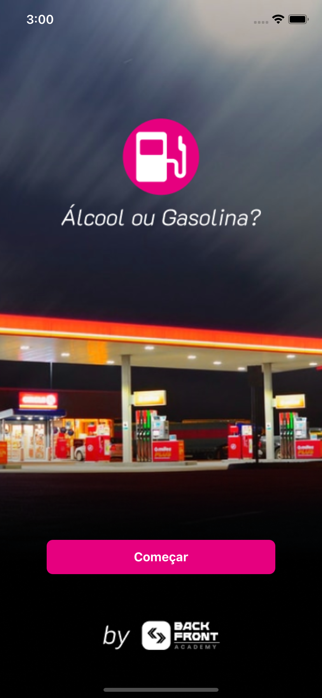
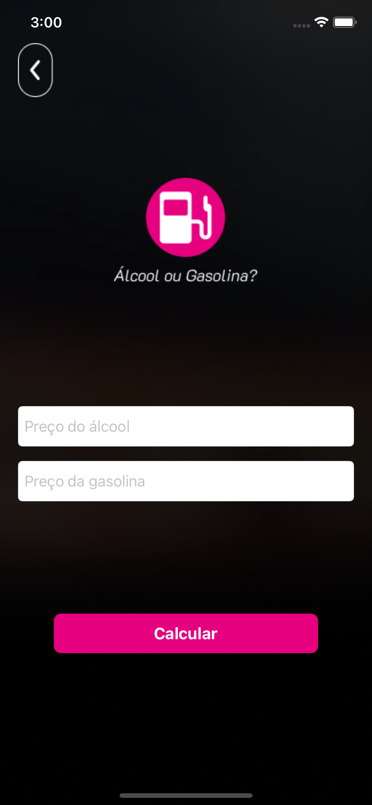
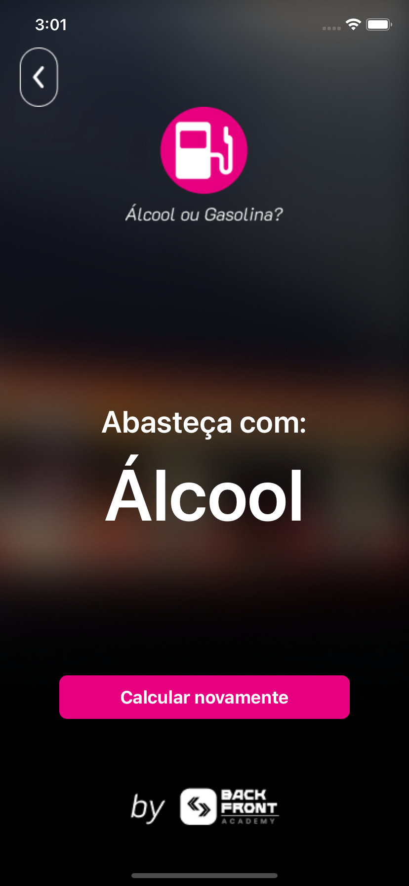

<h1 align="center">App Alcohol Or Gas</h1>

 

## :dart: About

This iOS app, built entirely using Swift and the ViewCode approach, empowers users to make informed decisions when it comes to fueling up their vehicles.

## :rocket: Technologies

The following tools were used in this project:

- [Swift](https://developer.apple.com/swift/)
- [UIKit](https://developer.apple.com/documentation/uikit)

## Screenshots

<a href="#top">Back to top</a>
